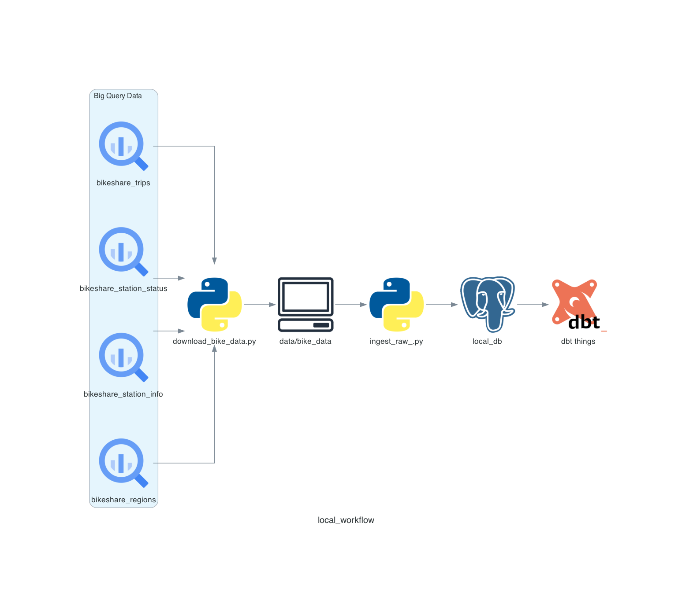
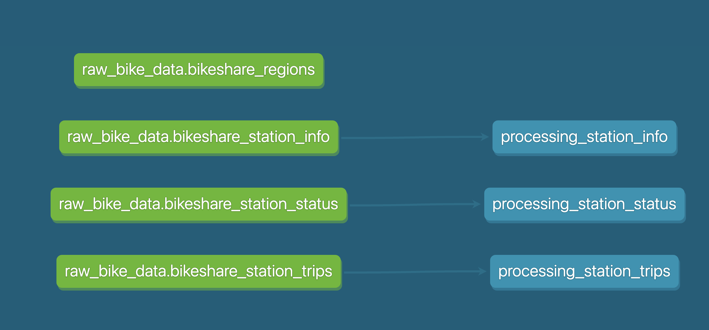
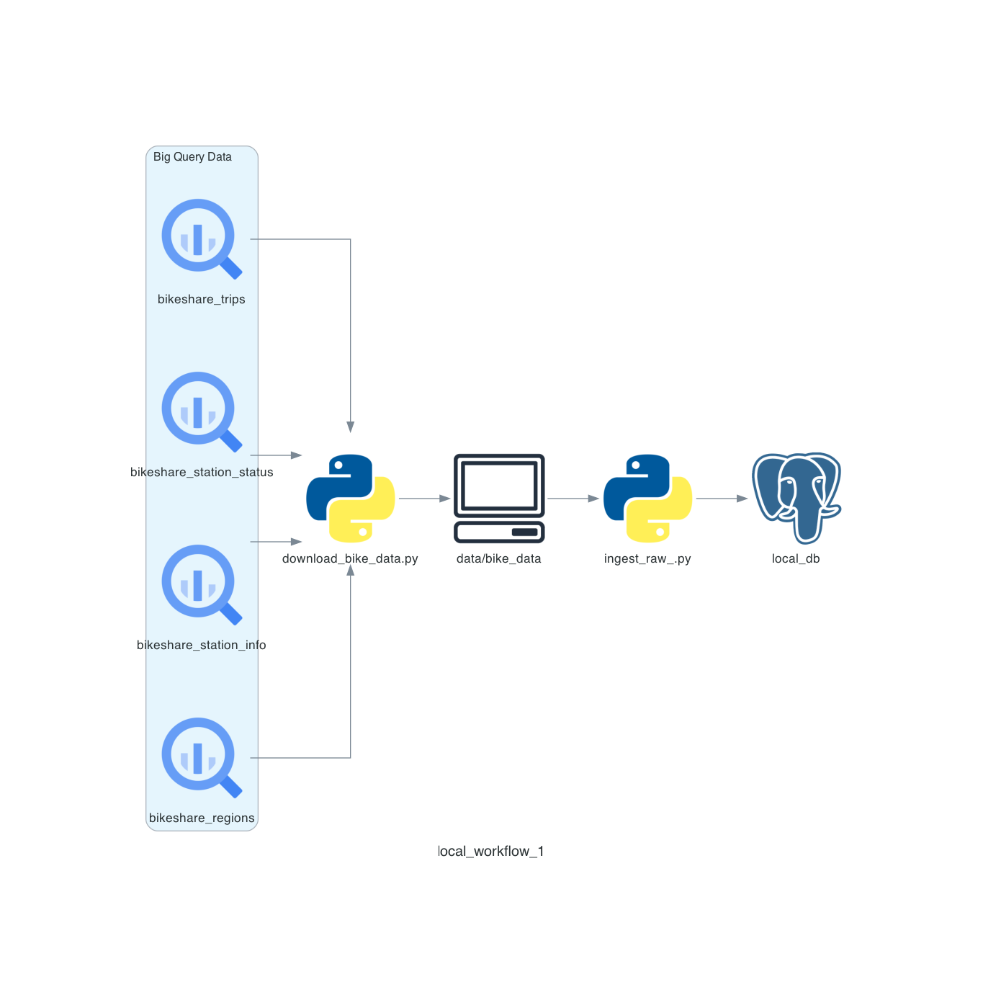

# sf-bike-data

ingesting, processing, &amp; analyzing sf bike share data

10/24/25

-   Added duckdb and dbt to start processing data
    
-   started to create data lineage to clean up and process bike data
-   brief view of what the lineage currently looks like
    

10/22/25

-   drew diagram to map out thoughts
-   downloaded csv data
-   here are my initial thoughts for digesting
    
